# Holiday Challenge


* ### To Create private instances with no public ip address
* ### To create a VPC,route tables and subnets for those instances
* ### To create a load balancer for the instances.
* ### To install Nginx on the server and configure Nginx for PHP files.
## Requirements
+ internet connection
+ AWS account 
+ Basic knowlege of instance.
+ Basic knowlege of Ansible. 


### To carry out these tasks i will breakdown the process into simple steps.
# Step 1
### 1. Create a VPC: on AWS
on the search panel input VPC, then click on create VPC. now select VPC and more to make the process much easier (AWS helps you create all other resource need for VPC).
+ input a name tag eg. projectVPC.
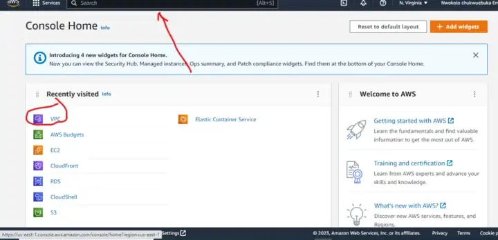
+ For IPV4 CIDR block you can put a range of ip address that will be given to your instances in that VPC eg. 10.0.0.0/16 

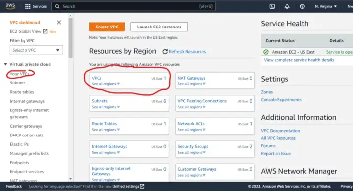
+ NAT gateway in AZ (Availability Zone) select 1 in AZ this will create a single gateway for internet connection to your instance.

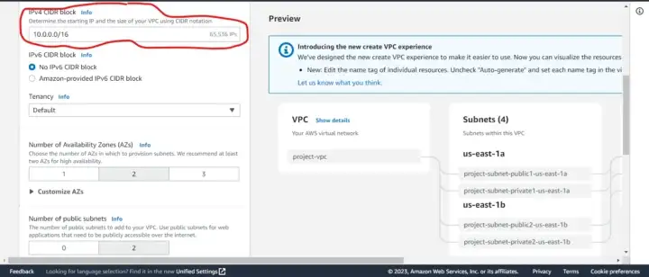
+ select S3 Gateway
+ Enable DNS hostname
+ Enable DNS resolution
+ click create VPC 

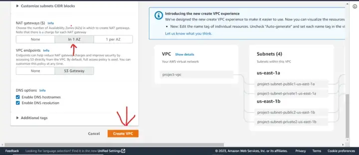

**Note:**  Any option not mentioned leave it as default.

# Step 2 
### 2. Create EC2 instance: on AWS search panel input EC2. Now click on launch instance

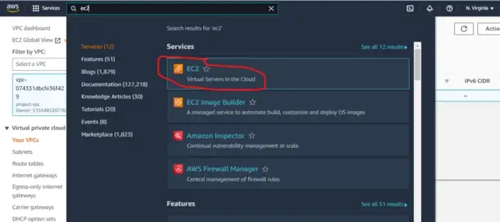
+ input a name for your instance. eg. server
+ on the summry pannel, Number of instance = 3

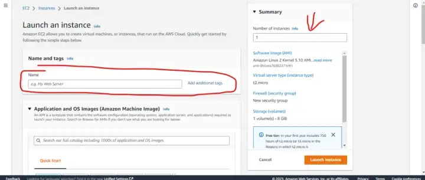
+ for os image select ubuntu or any image you are familiar with. this is the operating system that will run on the servers.

**Note:** for this demo practice i will be  selecting free tier version of all the resource in you.

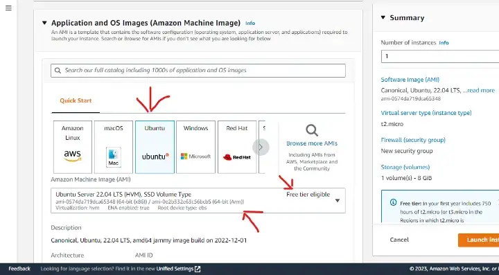
+ create a key pair that we would use through out this demo session. eg. key1
+ key pair type RSA , key format .pem then create key
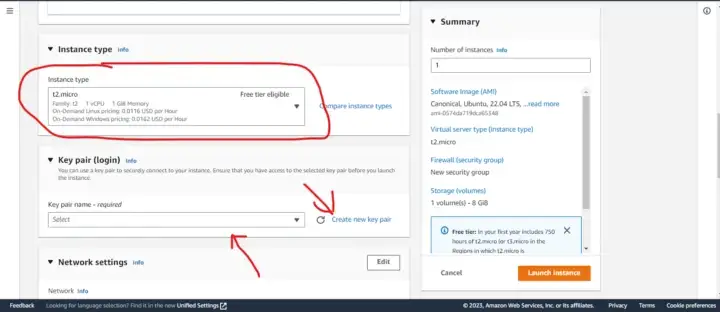
+ now select the created key pair.
+ click network settings to view all hidden options.

    + VPC - select the previously created VPC i.e projectVPC
    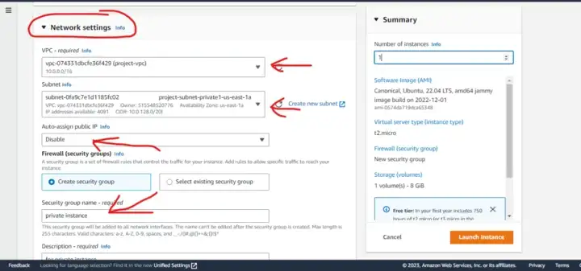
    + Subnet - select a private subnet
    + auto assign public ip - Disable
    + firewall(security group) select create security group.
        + input security group name. eg. instanceSECURITY
        + Edit the inbound rule to look like below.
        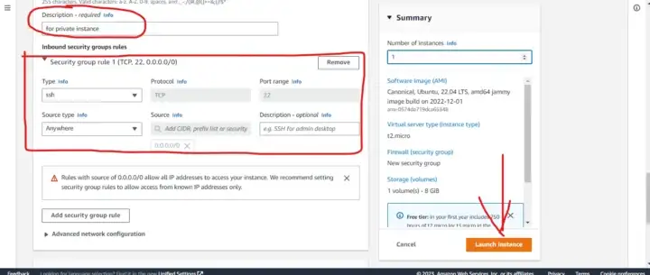
        + leave outbound rule as defaut.
    + select the created security group
    + click launch instance.

# Step 3
### 3. To create a bastion Host: This is also a server but its purpose is to help communicate with the private servers created in the private subnet. the bastion host will be created in same VPC but a public subnet.
+ On AWS search panel input EC2, input name bastion ,select operating system ubuntu.
+ select private key previously created i.e key1
+ click the network settings to view the hidden options
+ select the previously created VPC, select a public subnet.
+ select Auto asign public ip address - enabled
+ select the previous security group. i.e instanceSECURITY
+ now launch instance.
+ connect to the instance using ssh client( with private key on CLI) or aws instance connect( without private key on browser).
+ while connected to the bastion host create these fies.
    + sudo nano ansible.yml, then paste these template.
```       
---

- hosts: all
  become: yes
  tasks:

  - name: update & upgrade server
    apt:
      update_cache: yes
      upgrade: yes

  - name: install nginx
    apt:
      name: nginx
      state: latest

  - name: install php to run our code
    apt:
      name: php-fpm
      state: latest

  - name: remove the nginx file
    file:
      path: /var/www/html/index.nginx-debian.html
      state: absent

  - name: remove the default nginx file
    file:
      path: /etc/nginx/sites-available/default
      state: absent

  - name: copy the nginx default configuration file to server
    copy:
      src: default
      dest: /etc/nginx/sites-available
      owner: root
      group: root
      mode: 0744

  - name: To copy the php web page file to server.
    copy:
      src: index.php
      dest: /var/www/html
      owner: root
      group: root
      mode: 0744

  - name: restart nginx
    service:
      name: nginx
      state: restarted
      enabled: yes

```
+ save and close the file.
+ create another file called **default** *sudo nano default*
+ paste the below code 
```
server {
        listen 80 default_server;
        listen [::]:80 default_server;

        # SSL configuration
        #
        # listen 443 ssl default_server;
        # listen [::]:443 ssl default_server;
        #
        # Note: You should disable gzip for SSL traffic.
        # See: https://bugs.debian.org/773332
        #
        # Read up on ssl_ciphers to ensure a secure configuration.
        # See: https://bugs.debian.org/765782
        #
        # Self signed certs generated by the ssl-cert package
        # Don't use them in a production server!
        #
        # include snippets/snakeoil.conf;

        root /var/www/html;

        # Add index.php to the list if you are using PHP
        index index.php index.html index.htm index.nginx-debian.html;

        server_name _;

        location / {
                # First attempt to serve request as file, then
                # as directory, then fall back to displaying a 404.
                try_files $uri $uri/ =404;
        }

        # pass PHP scripts to FastCGI server
        #
        location ~ \.php$ {
                include snippets/fastcgi-php.conf;
        #
        #       # With php-fpm (or other unix sockets):
                fastcgi_pass unix:/run/php/php8.1-fpm.sock;
        #       # With php-cgi (or other tcp sockets):
        #       fastcgi_pass 127.0.0.1:9000;
        }

        # deny access to .htaccess files, if Apache's document root
        # concurs with nginx's one
        #
        location ~ /\.ht {
                deny all;
        }
}
```
+ save and close the file create another file called **ansible.cfg**
+ *sudo nano ansible.cfg*  
+ paste this text then save and close file.
```
[defaults]
host_key_checking = False
allow_world_readable_tmpfiles=true
inventory = inventory
private_key_file = ~/inst.pem
```
+ create the last file that is your private key *sudo nano key1.pem*
+ open your downloaded private key, copy it ,then paste it and save with same name from AWS.
+ now run *sudo chmod 400 key1.pem* this is to change the permission of the private key so it will not be rejected.
+ create another file called **inventory** *sudo nano inventory* 
+ paste the private ip address of the 3 servers you previously created.
+ now create another file called **index.php**
*sudo nano index.php* then paste this code. 
```
<!DOCTYPE html>
<html>
  <body>

    <h1> 
      Demo PHP page </h1>

    <h1>
      <?php

          echo "hostname is:".gethostname();

      ?>
    </h1>

  </body>
</html>
```
+ now run this code so we can make an installation 

*sudo apt update; sudo apt dist-upgrade -y*
+ now install Ansible
 
 *sudo apt install ansible*

**Note**: all the above actions is carried out on bastion server. To confirm that your bastion server can communicate with the private servers run this code on the bastion host 

*ssh -i "key pair name" ubuntu@private ip address* 

i.e ssh -i key1.pem ubuntu@10.0.0.23

+ now run the ansible.yml playbook using the command *ansible-playbook -i inventory filename.yml* 
i.e ansible-playbook -i inventory ansible.yml
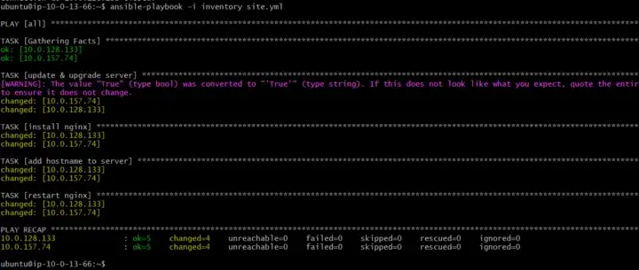

**NOTE:** these five files must be present on the bastion host before you run the ansible script.
*1.ansible.yml 2.default 3.inventory 4.index.php 5.key1.pem*

# step 4 
### 4. To create load balancer and Target group
+ on the AWS search panel input EC2 
+ scroll down to target group option
+ select create target group.
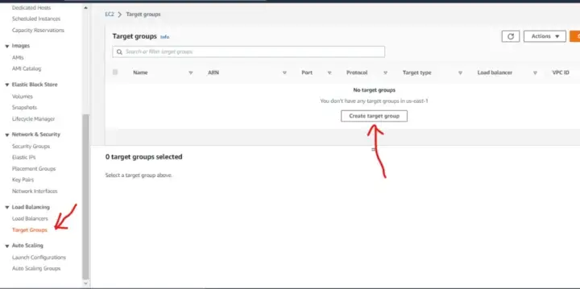
+ select instances
+ input a target group name eg. target1
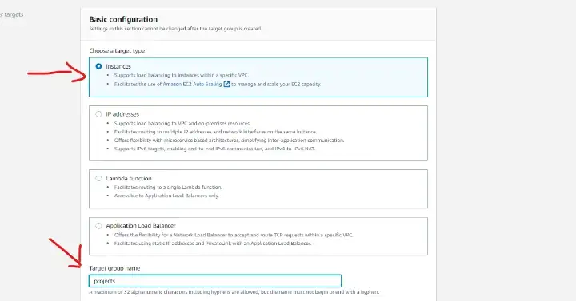
+ protocol HTTP port -80
+ VPC select the previously created VPC.
+ select HTTP1 , then next page
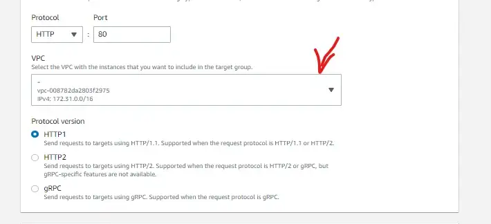
+ tick the radio buttons for the private servers created
+ click *include as pending below*
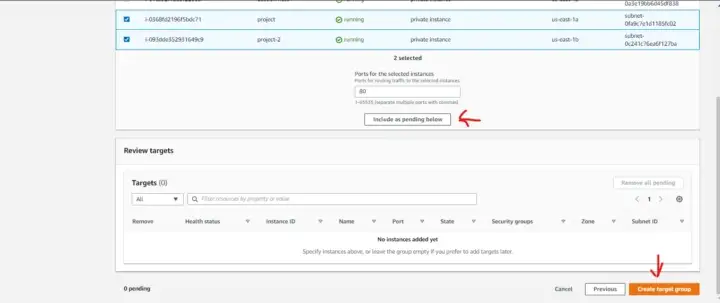
+ click on the part that says load balancer *none associated*
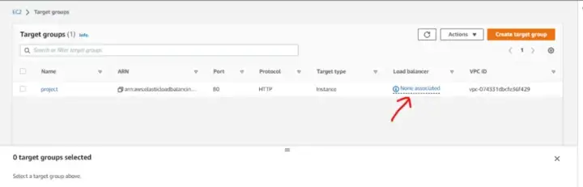

# step 5
### 5. creating a load balancer. for this practice we will be using Application load Balancer.
+ select create Application load balancer
+ inpute a name eg. loadB
+ select internet facing and ipv4.
+ select the previously created vpc.
+ under mapping, select all the public subnets buttons.
+ security group - create security group 
  + input security group name eg loadSEC
  + select the previosly created VPC.
  + create four inbound rules.
    + custom tcp - port 80 - anywhere ipv4.
    + custom tcp - port 80 - anywhere ipv6.
    + custom tcp - port 443 - anywhere ipv4.
    + custom tcp - port 443 - anywhere ipv6.
+ outbound rule all traffic 
+ save and create security group
+ select the new security group ie. loadSEC
+ listener HTTP -protocol -HTTP -port 80- default action select target group previously created.
+ click create load balancer.

# Step 6
### 6. to set instance security group to face lod balancer.
+ on AWS console search EC2 
+ scroll down to security group
+ select the security group created for instance.
+ add a new rule.
+ custon tcp - port 80 - then load balancer security group.
+ click save info .

# Step 7
### 7. To test the load balancer DNS link and connect it to route 53. 
+ click load balancer, then copy the DNS link and paste on your browser. it should open the newly created PHP page. 
+ on AWS console search panel inpute route 53 
+ create a hosted zone
+ edit the hosted zone record
+ turn on *Alias* then select load balancer from the options
+ then inpute load balancer DNS.
+ save the record
+ now connect any domain name you have with the hosted zone created.
